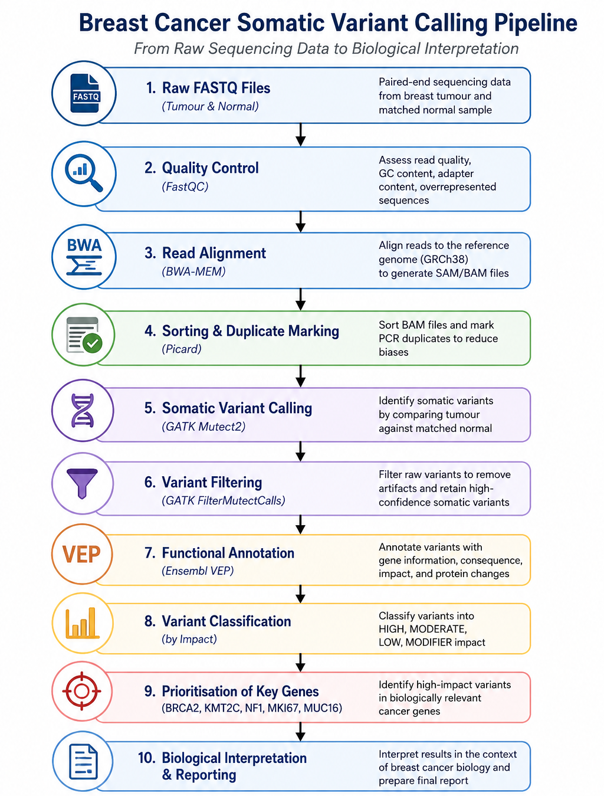
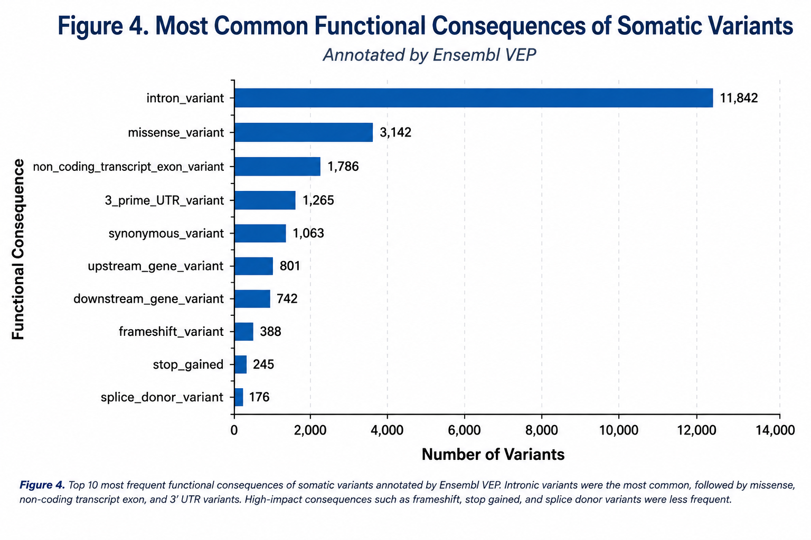
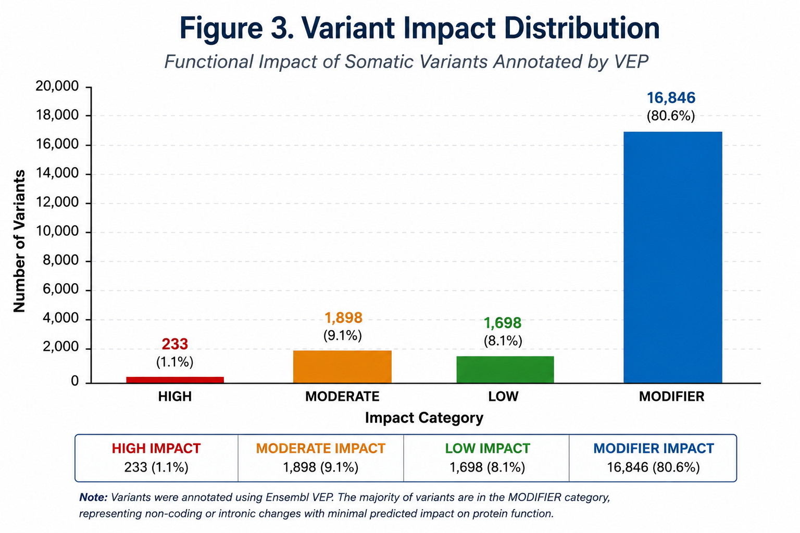
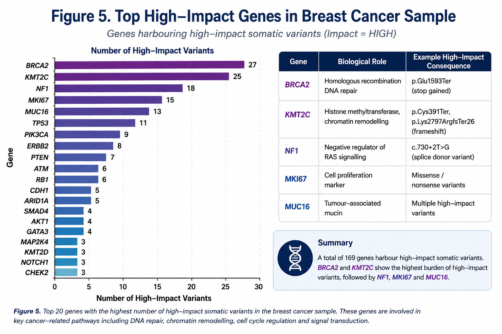

# Breast Cancer Somatic Variant Calling

A reproducible somatic variant-calling workflow for identifying and interpreting tumour-associated genetic variants from paired tumour–normal sequencing data. The project demonstrates a practical bioinformatics workflow from raw sequencing quality control through alignment, somatic variant calling, filtering, functional annotation, variant prioritisation, and biological interpretation.

> **Portfolio project:** Bioinformatics / Cancer Genomics
> **Reference genome:** GRCh38
> **Variant caller:** GATK Mutect2
> **Annotation:** Ensembl Variant Effect Predictor (VEP)

---

## Project overview

Cancer genomes accumulate somatic mutations that can alter genes involved in DNA repair, cell signalling, chromatin regulation, and other processes associated with tumour development.

The aim of this project was to analyse paired tumour and normal sequencing data from a breast cancer sample and identify high-confidence somatic variants, determine their predicted functional consequences, prioritise potentially important genes, and interpret selected variants in a biological and cancer-relevant context.

The workflow was designed to reflect a realistic somatic variant analysis rather than simply producing a list of variants. Each stage was used to improve data quality, establish confidence in the called variants, and progressively narrow the results towards biologically meaningful findings.

---

## Objective

The objectives of this analysis were to:

1. Perform quality control on paired-end tumour and normal sequencing reads.
2. Trim low-quality bases and adapter sequences.
3. Align sequencing reads to the human GRCh38 reference genome.
4. Process aligned reads, including sorting and duplicate marking.
5. Perform somatic variant calling using GATK Mutect2.
6. Apply variant-level filtering to remove likely technical artefacts and low-confidence calls.
7. Annotate filtered variants using Ensembl VEP.
8. Classify variants according to their predicted functional impact.
9. Identify and prioritise genes containing HIGH-impact variants.
10. Examine clinically and biologically relevant variants in selected cancer-associated genes.
11. Summarise the findings using tables and visualisations.
12. Evaluate the limitations of the analysis and distinguish computational prediction from clinical interpretation.

---

## Dataset

The analysis used paired tumour–normal sequencing data identified by the following sequencing run accessions:

* **SRR37849526**
* **SRR37849527**

The project used paired-end FASTQ files for the two samples.

The raw sequencing data are **not included in this repository** because of their large file size. The repository instead contains the processed results, summary tables, figures, and scripts required to document the analytical workflow.

### Data processing

The sequencing reads underwent:

* Initial quality control using **FastQC**
* Adapter and quality trimming using **fastp**
* Post-trimming quality assessment using **FastQC**
* Alignment to **GRCh38**
* BAM sorting
* Duplicate marking
* BAM quality assessment

---

## Analytical workflow

```text
Raw tumour/normal FASTQ
        │
        ▼
     FastQC
        │
        ▼
     fastp
        │
        ▼
   Post-trimming QC
        │
        ▼
   BWA-MEM alignment
        │
        ▼
 Sorted BAM files
        │
        ▼
 Duplicate marking
        │
        ▼
   GATK Mutect2
        │
        ▼
Somatic variant calls
        │
        ▼
 Variant filtering
        │
        ▼
      VEP
        │
        ▼
Functional consequence annotation
        │
        ▼
Impact classification
        │
        ▼
High-impact variant prioritisation
        │
        ▼
Biological interpretation
```



---

## Tools and technologies

| Stage              | Tool                   | Purpose                                                    |
| ------------------ | ---------------------- | ---------------------------------------------------------- |
| Quality control    | FastQC                 | Assess raw and processed sequencing quality                |
| Read preprocessing | fastp                  | Adapter trimming and quality filtering                     |
| Alignment          | BWA-MEM                | Align reads to GRCh38                                      |
| BAM processing     | SAMtools               | Sorting, indexing and alignment statistics                 |
| Duplicate marking  | GATK MarkDuplicates    | Identify PCR/optical duplicate reads                       |
| Somatic calling    | GATK Mutect2           | Detect tumour-specific candidate variants                  |
| Variant filtering  | GATK FilterMutectCalls | Remove low-confidence and likely artefactual calls         |
| Variant annotation | Ensembl VEP            | Predict variant consequences and annotate genomic features |
| Variant statistics | bcftools               | Summarise variant composition and call statistics          |
| Scripting          | Bash                   | Automate and document workflow steps                       |
| Visualisation      | Python/Matplotlib      | Generate portfolio figures                                 |

---

## Variant calling and filtering

Somatic variants were called from the paired tumour–normal data using **GATK Mutect2**.

The resulting calls were subsequently filtered using GATK's somatic variant filtering framework. This step was important because raw variant calls can contain sequencing, mapping, strand-bias, contamination, or other technical artefacts.

The final filtered VCF contained:

| Metric                            | Result |
| --------------------------------- | -----: |
| Samples                           |      2 |
| Variant records                   | 20,937 |
| SNPs                              | 15,097 |
| MNPs                              |    616 |
| Indels                            |  5,375 |
| Multiallelic sites                |  1,567 |
| SNP transition/transversion ratio |   1.20 |

Detailed statistics are available in [`results/variant_stats.txt`](results/variant_stats.txt).

---

## Functional consequence annotation

Filtered variants were annotated using **Ensembl Variant Effect Predictor (VEP)**.

The annotation classified variants according to their predicted consequences on genes and transcripts. The analysis identified a mixture of coding and non-coding consequences.

The most frequent annotated consequences included:

* Intron variants
* Non-coding transcript variants
* Non-coding transcript exon variants
* Missense variants
* UTR variants
* Synonymous variants
* Frameshift variants
* Inframe deletions
* Stop-gained variants
* Splice-region and splice-site variants

The presence of many non-coding variants is expected in a whole-genome or broadly captured variant set. Importantly, the project did not assume that all detected variants would be protein-altering. Instead, variants were subsequently prioritised according to their predicted functional impact.



Detailed counts are available in [`tables/functional_consequences.csv`](tables/functional_consequences.csv).

---

## Variant impact classification

VEP consequences were grouped according to their predicted impact:

* **HIGH** — variants predicted to have a major effect on gene function
* **MODERATE** — variants potentially affecting protein function
* **LOW** — variants with less severe predicted effects
* **MODIFIER** — variants with limited or uncertain predicted functional impact

The impact distribution is shown below.



The corresponding summary table is available in [`tables/variant_impact_summary.csv`](tables/variant_impact_summary.csv).

---

## High-impact variant prioritisation

Rather than selecting genes simply because they occurred frequently in the annotated dataset, the biological interpretation focused on genes containing **HIGH-impact variants**.

The final high-impact gene list contains **169 genes**. This list was generated directly from the HIGH-impact annotated variant set and includes genes such as:

* **BRCA2**
* **KMT2C**
* **NF1**
* **MKI67**
* **KMT2B**
* **MUC4**
* **MUC16**
* **MUC6**
* **FLG**
* **HLA-DQA1**
* **HLA-DRB1**
* and other genes identified in the analysed sample.

The complete list is available in [`results/high_impact_genes.txt`](results/high_impact_genes.txt).



The gene-level summary is available in [`tables/high_impact_gene_summary.csv`](tables/high_impact_gene_summary.csv).

---

## Biological interpretation of selected high-impact variants

Three genes were selected for detailed interpretation because they contained particularly relevant HIGH-impact variants and have established biological roles in cancer.

### BRCA2

A HIGH-impact **stop-gained** variant was identified in **BRCA2**:

**c.4777G>T; p.Glu1593Ter**

A stop-gained mutation introduces a premature termination codon into the coding sequence. This is predicted to produce a truncated BRCA2 protein with reduced or complete loss of normal function.

BRCA2 is a tumour suppressor involved in homologous recombination-mediated repair of DNA double-strand breaks. Loss of BRCA2 function can impair DNA repair and contribute to genomic instability.

BRCA2 deficiency is well established in breast cancer and can be associated with homologous recombination deficiency (HRD), which has therapeutic relevance because some BRCA-deficient tumours may respond to PARP inhibition.

**Interpretation for this sample:**
The identification of the HIGH-impact stop-gained variant suggests that BRCA2 function may be substantially disrupted in this tumour, potentially contributing to defective DNA repair and genomic instability.

> This interpretation represents a computational and biological interpretation of the variant. It does not establish clinical pathogenicity or treatment eligibility for the individual sample.

---

### KMT2C

Two HIGH-impact variants were identified in **KMT2C**:

* **Frameshift:** p.Lys2797ArgfsTer26
* **Stop-gained:** p.Cys391Ter

A frameshift mutation changes the reading frame of the coding sequence and alters downstream amino acids, often resulting in a premature termination codon. A stop-gained variant independently introduces an early termination codon.

**KMT2C**, also known as **MLL3**, encodes a histone methyltransferase involved in chromatin regulation and control of gene expression. Loss-of-function alterations in KMT2C have been reported in several cancers, including breast cancer.

**Interpretation for this sample:**
The presence of two independent HIGH-impact protein-disrupting variants in KMT2C suggests substantial disruption of KMT2C function and raises the possibility that altered epigenetic regulation contributes to the molecular profile of this tumour.

---

### NF1

A HIGH-impact **splice donor** variant was identified in **NF1**:

**c.730+2T>G**

Splice donor variants occur at exon–intron boundaries and can disrupt normal RNA processing. Depending on the resulting transcript, this can cause abnormal splicing, exon skipping, intron retention, or production of an abnormal protein.

**NF1** encodes neurofibromin, a tumour suppressor that negatively regulates RAS signalling. Loss of NF1 function can increase RAS pathway activity and promote cellular proliferation.

**Interpretation for this sample:**
The HIGH-impact splice donor variant is predicted to disrupt normal NF1 transcript processing and may impair neurofibromin function. This provides a biologically plausible mechanism for increased RAS signalling and altered tumour-cell proliferation.

---

## Clinical relevance

The selected variants demonstrate why functional annotation is useful for somatic cancer analysis.

In particular:

* **BRCA2** provides a biologically important link to DNA double-strand break repair and homologous recombination deficiency.
* **KMT2C** provides evidence of potential disruption of chromatin and epigenetic regulation.
* **NF1** provides a potential mechanism involving dysregulation of RAS signalling.

However, these findings should **not be interpreted as clinical diagnoses**.

The analysis was performed as a computational portfolio project using sequencing data and public annotation resources. Clinical interpretation would require additional evidence, including validated variant classification frameworks, orthogonal confirmation where appropriate, tumour purity and clonality assessment, clinical context, germline/somatic distinction where relevant, and review against current clinical databases and guidelines.

---

## Pathway analysis

Pathway-level interpretation was explored using enrichment analysis.

Some of the prioritised genes were represented in cancer-related pathways; however, the analysed gene set did **not produce statistically significant pathway enrichment after multiple-testing correction**.

Therefore, no pathway was presented as a statistically significant finding.

This distinction is important: the presence of a gene in a pathway does not demonstrate that the pathway is significantly enriched in the sample.

The pathway analysis was therefore treated as **supporting biological context rather than a primary statistical conclusion**.

---

## Key results

The main findings from the analysis were:

1. A complete tumour–normal somatic variant-calling workflow was implemented.
2. The final filtered VCF contained **20,937 variant records**.
3. The majority of variants were SNPs, followed by indels and MNPs.
4. VEP identified a broad range of functional consequences across coding and non-coding regions.
5. HIGH-impact variants were isolated for downstream prioritisation.
6. A set of **169 genes** containing HIGH-impact variants was generated.
7. **BRCA2, KMT2C and NF1** were selected for detailed biological interpretation.
8. The BRCA2 variant was a HIGH-impact stop-gained alteration, **p.Glu1593Ter**.
9. KMT2C contained two HIGH-impact protein-disrupting variants: a frameshift and a stop-gained variant.
10. NF1 contained a HIGH-impact splice donor variant.
11. Pathway analysis provided biological context but did not produce statistically significant enrichment after multiple-testing correction.

---

## Limitations

Several limitations should be considered when interpreting these results.

### 1. Portfolio-scale analysis

This project was designed as a reproducible bioinformatics portfolio project rather than a clinical diagnostic workflow. The results therefore demonstrate analytical reasoning and technical workflow implementation but should not be used for patient management.

### 2. Variant calling confidence

Somatic variant detection is affected by sequencing depth, tumour purity, allele fraction, mapping quality, sequencing artefacts and other technical factors. Although Mutect2 filtering was applied, additional validation would be required for clinical use.

### 3. Functional prediction

VEP consequences represent predicted effects based on genomic and transcript annotation. A HIGH-impact classification does not independently prove that a variant is pathogenic or that it has a specific functional effect in the tumour.

### 4. Clinical interpretation

The biological interpretations presented here are hypothesis-generating. Clinical classification would require additional evidence and appropriate clinical guidelines/databases.

### 5. Pathway enrichment

Pathway membership alone was not treated as evidence of pathway activation. Because the enrichment analysis did not remain statistically significant after adjustment for multiple testing, pathway findings were not presented as definitive conclusions.

### 6. Large sequencing files

Raw FASTQ files, BAM files and reference genome files are not stored in the GitHub repository because of their size. The repository instead contains the scripts, summary outputs, tables and figures necessary to document the analysis.

### 7. Single-sample analysis

This analysis is based on a single tumour–normal pair. Findings reflect the somatic variant profile of this individual sample and should not be generalised to breast cancer as a whole without validation across additional patients/cohorts.

### 8. Mapping artefacts in complex genomic regions

Some genes in the HIGH-impact list — including HLA loci (e.g. HLA-DQA1, HLA-DRB1) and mucin genes (e.g. MUC4, MUC16, MUC6) — lie in highly polymorphic or repetitive genomic regions that are prone to alignment and mapping artefacts. HIGH-impact calls in these regions are more likely to reflect technical mapping difficulty than genuine truncating somatic mutations, and would require additional scrutiny (e.g. manual alignment review, orthogonal confirmation) before being treated as biologically meaningful.
---

## Reproducibility

The repository is organised so that the main analytical stages can be followed from the shell scripts:

```text
scripts/
├── 01_quality_control.sh
├── 02_alignment_and_bam_processing.sh
├── 03_somatic_variant_calling.sh
├── 04_variant_filtering.sh
├── 05_variant_annotation.sh
└── 06_variant_summary.sh
```

The scripts document the commands used for the major stages of the workflow.

Processed summary outputs are provided in:

```text
results/
├── high_impact_genes.txt
└── variant_stats.txt
```

Summary tables are provided in:

```text
tables/
├── functional_consequences.csv
├── high_impact_gene_summary.csv
├── pipeline_tools.csv
├── variant_impact_summary.csv
└── variant_summary.csv
```

Figures generated from the analysis are provided in:

```text
figures/
├── functional_consequences.png
├── impact_distribution.png
├── pipeline_workflow.png
├── top_high_impact_genes.png
└── variant_types.png
```

Large raw and intermediate sequencing files are excluded using `.gitignore`.

---

## Repository structure

```text
breast-cancer-somatic-variant-calling/
│
├── figures/
│   ├── functional_consequences.png
│   ├── impact_distribution.png
│   ├── pipeline_workflow.png
│   ├── top_high_impact_genes.png
│   └── variant_types.png
│
├── results/
│   ├── high_impact_genes.txt
│   └── variant_stats.txt
│
├── scripts/
│   ├── 01_quality_control.sh
│   ├── 02_alignment_and_bam_processing.sh
│   ├── 03_somatic_variant_calling.sh
│   ├── 04_variant_filtering.sh
│   ├── 05_variant_annotation.sh
│   └── 06_variant_summary.sh
│
├── tables/
│   ├── functional_consequences.csv
│   ├── high_impact_gene_summary.csv
│   ├── pipeline_tools.csv
│   ├── variant_impact_summary.csv
│   └── variant_summary.csv
│
├── .gitignore
└── README.md
```

---

## Conclusion

This project demonstrates an end-to-end approach to somatic variant analysis in breast cancer, moving from raw sequencing quality control to variant calling, filtering, annotation, prioritisation and biological interpretation.

The analysis identified a substantial set of predicted functional variants and highlighted several biologically important genes. In particular, HIGH-impact variants affecting **BRCA2, KMT2C and NF1** provided plausible links to impaired DNA repair, altered epigenetic regulation and dysregulated cell-signalling pathways.

The project also demonstrates an important principle of cancer bioinformatics: **variant detection is only the first step**. Meaningful interpretation requires consideration of variant quality, functional consequence, gene biology, statistical evidence and clinical context.

Overall, the workflow provides a reproducible framework for investigating somatic variation while clearly distinguishing computational predictions from clinically validated conclusions.

---

## Skills demonstrated

* Somatic variant calling
* Tumour–normal variant analysis
* NGS quality control
* FASTQ preprocessing
* Read alignment
* BAM processing
* Duplicate marking
* GATK Mutect2
* Variant filtering
* VEP functional annotation
* bcftools variant statistics
* Variant prioritisation
* Cancer genomics
* Functional consequence analysis
* Biological interpretation
* Bash scripting
* Data summarisation
* Scientific visualisation
* Reproducible bioinformatics workflows
* Critical evaluation of analytical limitations

---

Note: This is a portfolio/research project and the results are not intended for clinical diagnosis or treatment decisions.
